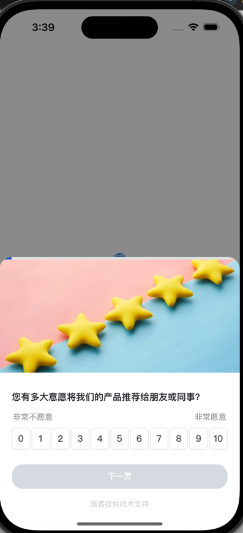

# howxm-ios-swift-demo

> Swift 项目调用SDK代码示例
> 
## 1.安装sdk，建议使用pod安装, 详情参考：https://howxm.com/help/articles/ios-x-sdk
> pod 'Howxm', '版本号'

## 2.代码中调用SDK接口, 更多示例参考 - [ContentView.swift](howxm-ios-swift-demo/ContentView.swift)
```swift
Howxm.logLevel = .debug

Howxm.initializeSDK(
        "your appid",
        "your root view controller",
        {
            print("initializeSDK completion")
        }
)
```

## 弹出效果 (系统启动点击按钮弹出)
